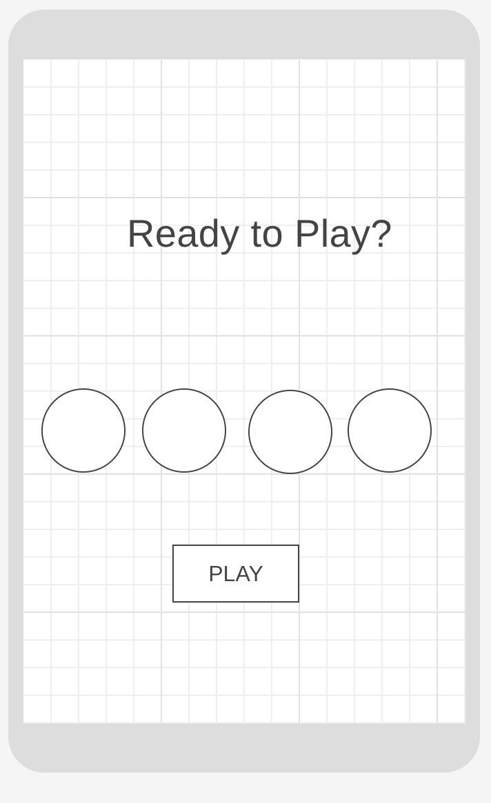
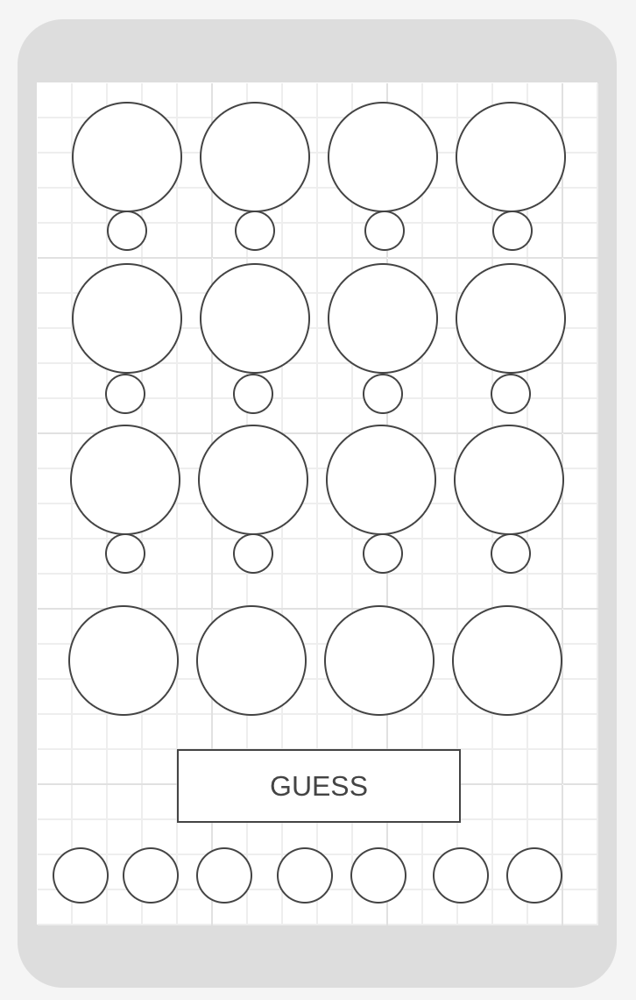

# MasterMind
A mobile-first web-based game of guess-the-sequence
### Project Started: 2024/05/07
### By: Paul Burgess
#### [LinkedIn](https://www.linkedin.com/in/paul-burgess-a11154181/) 

***

### **Description**
In this game, the computer creates a secret code--a sequence of four colours in a row. The player then attempts to guess the correct colours in the correct order (doubles are not allowed). Each position in each guessed sequence is evaluated in one of three ways:
1. Correct colour in the correct position (marked Black)
2. Correct colour but in the wrong spot (marked White) 
3. The wrong colour altogether (no mark)

Depending on how many attempts it takes to guess the sequence, different funny messages will appear.

---

### **Languages Employed**

- HTML 
- CSS
  - Flexbox
  - Grid
- JavaScript
---

### **Getting Started**

Playing is simple: the game can be found at --LINK--
Press play, choose a colour, and start guessing!

---

### **Screenshots**

##### Landing Page

##### Game Page

---

### **Future Updates**

- [ ] Hard mode (Evaluations do not correspond to the position they are under)
- [ ] Two player mode (Players go back and forth setting the sequence; the first to 50 guesses looses)
- [ ] Super Hard Mode (Multiples of the same colour are allowed)

---

### **Credits**

##### Markdown Lesson: [GA GitHb](https://github.com/SEB-2-26/u1_lab_markdown)

---
